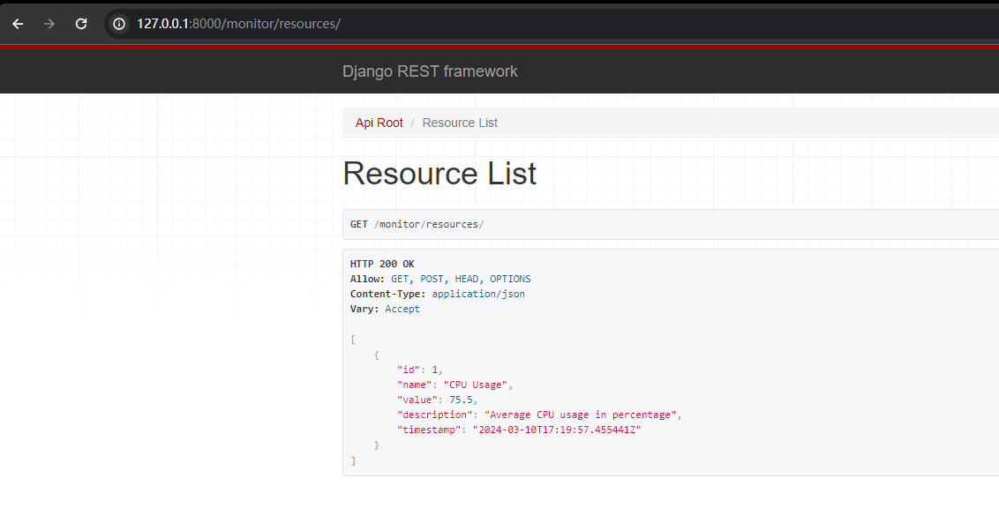

该文档是 Django 后端工作文档。

# 环境设置
我们可以按照以下步骤来设置 Django 后端环境，并开始工作：

## 激活 Python 虚拟环境：
在命令行中，导航到 db_web 目录并激活虚拟环境（db_web）。
```sh
.\Scripts\activate
```

## 安装 Django 和 Django REST framework：
在激活的虚拟环境中，使用pip安装Django和Django REST framework：
```sh
pip install django djangorestframework
```

## 创建Django项目：
使用 django-admin 命令来创建一个新的 Django 项目。确保在我的虚拟环境中，并在 DB_WEB 目录下执行此操作：
```sh
django-admin startproject db_django
```

## 创建Django应用：
Django 项目是由多个应用组成的，每个应用负责处理项目的一部分功能。在项目目录中创建我们的第一个应用：
```sh
python manage.py startapp myapp
```
同样的，将myapp替换为自己的应用名称。

## 配置Django应用：
在项目的 settings.py 文件中，将您创建的应用和 rest_framework 添加到 INSTALLED_APPS 中。

## 创建模型：
在应用的 models.py 中定义你的数据模型。这些模型将映射到数据库中的表。

## 数据库迁移：
完成模型定义后，使用以下命令创建数据库迁移文件，并应用这些迁移来更新数据库。
```sh
python manage.py makemigrations
python manage.py migrate
```

## 创建序列化器：
在应用目录中创建 serializers.py 文件，并定义序列化器，这些序列化器将负责转换模型实例与 JSON 之间的数据。

## 创建视图和路由：
在 views.py 中定义视图，使用 urls.py 来创建 API 的 URL 路由。

## 运行开发服务器：
使用以下命令来启动Django的开发服务器：
```sh
python manage.py runserver
```
然后可以通过访问http://127.0.0.1:8000/来看到网站。

## 测试API：
开发好API之后，您可以使用工具如 curl、Postman 或任何前端技术栈来测试 API 的响应和行为。另外，查看 Django 和 Django REST framework 的官方文档是学习和参考的极佳资源。<br>
Django 官方文档：https://docs.djangoproject.com/en/5.0/intro/tutorial01/ <br>
Django REST framework 官方文档：https://www.django-rest-framework.org/tutorial/quickstart/


# 建立后端逻辑，并将其与前端连接的一个成功小案例说明

## 1、先创建Django应用（以方便管理）
```sh
python manage.py startapp monitor
```
记得创建后去根目录（即db_django/db_django）中的 setting 文件中的 INSTALLED_APPS 配置。

## 2、创建数据模型
既然我们需要监控服务器和数据库资源，我们首先需要定义模型来存储这些数据。由于我们目前只是创建一个原型，我们可以定义一个简单的模型来代表一个通用的资源项。
在 monitor 应用的 models.py 文件中定义如下模型：
```python
from django.db import models

class Resource(models.Model):
    name = models.CharField(max_length=200)
    value = models.FloatField()
    description = models.TextField()
    timestamp = models.DateTimeField(auto_now_add=True)

    def __str__(self):
        return self.name
```
如果模型没有在 Django admin 中注册，那么即使数据库迁移已经完成，你也不会在管理界面中看到你的模型。
需要在 monitor/admin.py 文件中添加以下代码来注册 Resource 模型：
```python
from django.contrib import admin
from .models import Resource

# Register your models here.
admin.site.register(Resource)
```

## 3、创建序列化器
序列化器负责将模型实例转换为JSON格式，以便它们可以通过 HTTP 发送。在 monitor 应用中创建一个新文件 serializers.py 并添加以下内容：
```python
from rest_framework import serializers
from .models import Resource

class ResourceSerializer(serializers.ModelSerializer):
    class Meta:
        model = Resource
        fields = '__all__'
```

## 4、创建视图
我们将使用 Django REST framework 的视图来创建API。在 monitor 的 views.py 文件中添加以下内容：
```python
from rest_framework import viewsets
from .models import Resource
from .serializers import ResourceSerializer

class ResourceViewSet(viewsets.ModelViewSet):
    queryset = Resource.objects.all()
    serializer_class = ResourceSerializer
```

## 5、配置URL路由
在 monitor 目录 urls.py 文件中，我们需要创建一个路由来让HTTP请求与视图关联。添加以下内容：
```python
from django.urls import path, include
from rest_framework.routers import DefaultRouter
from .views import ResourceViewSet

router = DefaultRouter()
router.register(r'resources', ResourceViewSet)

urlpatterns = [
    path('', include(router.urls)),
]
```
这将创建一个 /resources 路径，它将映射到 ResourceViewSet，它可以处理常规的CRUD操作。


然后重点来了，在项目根目录的 urls.py 添加 monitor 的 URL
```python
# db_django/urls.py
from django.contrib import admin
from django.urls import path, include  # 确保已经导入了include

urlpatterns = [
    path('admin/', admin.site.urls),
    path('monitor/', include('monitor.urls')),  # 添加这一行来包含monitor应用的urls
]
```

## 6、启动开发服务器
在终端中运行以下命令：
```sh
python manage.py runserver
```
这将启动开发服务器，你可以通过访问对应 url 来看到你的API。

## 7、向服务器添加模拟数据
可以通过 Django 管理界面添加模拟数据，或者使用例如 curl 或 Postman 的工具来发送 HTTP POST 请求。

例如，使用curl命令添加资源：
```sh
curl -X POST http://127.0.0.1:8000/monitor/resources/ -H 'Content-Type: application/json' -d '{"name": "CPU Usage", "value": 75.5, "description": "Average CPU usage in percentage"}'
```
在Windows PowerShell中，请确保整个命令是单行的，并且如果你在Windows上，可能需要使用双引号而不是单引号，或者在JSON字符串内部的双引号前加上转义字符：
```sh
curl -X POST http://127.0.0.1:8000/monitor/resources/ -H "Content-Type: application/json" -d "{\"name\": \"CPU Usage\", \"value\": 75.5, \"description\": \"Average CPU usage in percentage\"}"
```
结果如图所示：


## N、辅助调试
可以在终端中运行以下命令来生成整个项目的URL映射，这有助于调试URL问题：
```sh
python manage.py show_urls
```
如果 Django 项目没有这个命令，你可能需要安装 django-extensions 包来获取它：
```sh
pip install django-extensions
```
然后在 settings.py 文件中添加 'django_extensions' 到 INSTALLED_APPS 列表。


# 本地环境如何能和远程服务器环境一致
保证本地开发环境，和线上一致性的步骤

1.导出本地python环境的所有模块<br>
pip3 freeze > requirements.txt 

2.将这个依赖文件，发送给linux服务器<br>
requirements.txt 

3.服务器linux上，构建虚拟环境，安装这个文件，即可<br>
pip3 install -i https://pypi.tuna.tsinghua.edu.cn/simple  -r requirements.txt 


# 是否可以从数据库生成django模型呢？
我觉得 Django 和 Django ORM 的易用性很高，我想知道是否可以“反向”使用它，就是能不能够根据数据库表结构，自动生成 Django 模型代码。<br>
answer:
~~~
使用 inspectdb 命令：(支持 mysql、sqlite 和 postgresql)

只需运行 python manage.py inspectdb 将为数据库中的所有表创建类并显示在控制台上。

$ python manage.py inspectdb

使用标准 Unix 输出重定向将其保存为文件：

$ python manage.py inspectdb > models.py
~~~

# django和mysql数据库的连接相关问题
1. 首先，确保你的 Django 项目的 setting.py 正确配置了数据库设置
```python
DATABASES = {
    'default': {
        'ENGINE': 'django.db.backends.mysql',  // mysql数据库固定写法
        'NAME': 'tt',     // 数据库名
        'USER': 'root',    // 数据库用户
        'PASSWORD': '2002',
        'HOST': 'localhost',  # Or an IP Address that your DB is hosted on
        'PORT': '3306',
    }
    #'default': {
     #   'ENGINE': 'django.db.backends.sqlite3',
      #  'NAME': BASE_DIR / 'db.sqlite3',
    #}
}
```
配置完之后，马上应用数据库迁移
```sh
python manage.py makemigrations
python manage.py migrate
```
2. 然后，检查你的数据库连接是否正常（optional）
```sh
python manage.py shell
from django.db import connection
connection.ensure_connection()
```
3. 最后，检查你的模型是否正确映射到数据库表
```sh
python manage.py inspectdb
```
4. 如果你需要修改数据库表结构，可以使用 Django 的 ORM 来实现
5. 这个时候你就可以在mysql本地终端看到原本为空的数据库tt的Django迁移过来的tables了；
6. 这个时候可能有人就想问了，那我用mysql对本地数据库tt进行CURD操作，那怎么同步到Django后端中呢？
~~~
这是一个好问题。
为了在 Django 管理后台查看和管理在 MySQL 终端创建的表，一定要在 Django 中定义相应的模型。
那么如何快速定义Mysql中的模型呢？
答案显然就是使用 inspectdb
~~~
~~~
python manage.py inspectdb user > models.py
这将生成 user 表的 Django 模型，并将其输出到 models.py 文件。我们可能需要编辑生成的模型代码以确保它符合 Django 的模型规范（如设置合适的字段选项）。
如果 models.py 文件不在任何已存在的 Django 应用文件夹中，请将其移动到一个应用文件夹内。（或者cv models）
~~~
接着在相应应用的 admin.py 文件中，注册新的模型以便在管理后台中出现。例如：
```python
from django.contrib import admin
from .models import User  # 根据生成的模型类名导入

@admin.register(User)
class UserAdmin(admin.ModelAdmin):
    list_display = ('id', 'name', 'email')  # 设置显示的字段
```
最后执行数据库迁移。<br>
请注意，模型类名（在本例中使用 User）需要与实际在数据库中的表名匹配。如果 Django 自动生成的模型名称与我们的表名不匹配，我们可能需要在模型类的 Meta 类中指定数据库表名：
```python
class User(models.Model):
    # ...
    class Meta:
        db_table = 'user'  # 指定实际数据库中的表名
```

# Django 项目结构中各个文件和目录的作用

### 项目根目录 (db_django)：
~~~
__init__.py：一个空文件，告诉 Python 这个目录应该被认为是一个 Python 包。
asgi.py：用于配置 ASGI 兼容的服务器以运行您的项目，用于异步功能。
settings.py：Django 项目的设置/配置文件。
urls.py：项目级的 URL 声明，用于定义 URL 模式和视图的关系。
wsgi.py：用于配置 WSGI 兼容的服务器以运行您的项目，用于部署。
manage.py：一个命令行工具，用于执行各种 Django 任务，如运行服务器、创建迁移等。
~~~
### 应用目录 (monitor)：一个 Django 应用是一个包含视图、模型、表单、模板等的 Python 包。
~~~
__init__.py：同样是一个空文件，将应用目录定义为 Python 包。
admin.py：这个文件用于注册模型以在 Django 管理后台中显示。
apps.py：包含应用的配置类，通常用于应用的初始化设置。
models.py：定义应用的数据库模型（即 ORM 中的类，映射到数据库中的表）。
tests.py：用于编写测试用例。
views.py：包含处理请求和返回响应的视图函数或视图类。
urls.py：应用级的 URL 声明，类似于项目级的 urls.py，但专门用于该应用的视图。
serializers.py：如果您使用 Django REST framework，此文件用于定义如何将模型数据序列化为 JSON 或其他内容格式。
~~~
### 其他文件：
~~~
db.sqlite3：Django 默认的 SQLite 数据库文件。
models.py（位于项目根目录）：可能是通过 inspectdb 命令生成的，包含根据现有数据库表生成的模型。
目录中的 SQL 文件（如 CREATE, FLUSH, GRANT）：这些文件看起来像是包含 SQL 语句的脚本文件，可能用于数据库的初始化或权限设置。
~~~
### Django 的 MVC/MVT 模式
Django 遵循类似 MVC（Model-View-Controller）的模式，但它被称为 MVT（Model-View-Template）模式。在这个模式中：

Model（模型） 对应于 models.py，代表数据库的结构和行为。
View（视图） 对应于 views.py，处理用户请求并返回响应。
Template（模板） 是 HTML 文件，用来生成用户可见的页面。
URLconf（URL配置） 在 urls.py 中定义，关联 URL 路径到视图。

### 文件和目录之间的联系
manage.py：<br>
这是一个命令行工具，用来与 Django 项目交互。例如，你通过这个脚本来运行开发服务器（python manage.py runserver）、创建应用（python manage.py startapp）、进行数据库迁移（python manage.py makemigrations 和 python manage.py migrate）等。<br>

项目配置（settings.py, urls.py, wsgi.py, asgi.py）：<br>

settings.py 包含全局设置，包括数据库配置、中间件、应用注册等。<br>
urls.py 是 URL 路由配置，它告诉 Django 某个 URL 应该由哪个视图处理。<br>
wsgi.py 和 asgi.py 配置项目如何与 Web 服务器接口，前者用于同步处理，后者用于异步处理。<br>

应用（如 monitor）：<br>
每个 Django 应用包含其独立的模型、视图、模板和 URL 配置。应用是可重用的组件，意味着它们可以在不同项目之间共享。

admin.py 用于将模型注册到 Django 的管理后台，使其可以通过 Web 界面管理。<br>
models.py 定义数据模型，这些模型会映射到数据库中的表。<br>
views.py 包含业务逻辑，它们接收 Web 请求并返回响应。<br>
urls.py 包含该应用的 URL 配置，它通常被包含到项目级的 urls.py 中。<br>
tests.py 包含应用的测试用例，用于自动测试其行为是否符合预期。<br>
serializers.py（在使用 Django REST framework 时）用于将模型实例转换为 JSON 格式，或从 JSON 转换回模型实例。<br>
apps.py 文件中的 AppConfig 类是定义应用配置的地方。每个 Django 应用都可以包含一个 AppConfig 子类，用于存储应用相关的配置信息。Django 使用这些信息来：
~~~
设置应用的名称（可以用于在 INSTALLED_APPS 设置中引用应用）。
配置应用的默认自动字段类型（在例子中，使用 BigAutoField 作为主键字段的默认类型）。
执行应用启动时的初始化代码（如连接信号处理器）。

通常情况下，如果你没有特别的配置需要添加，你可能不会频繁地修改 apps.py 文件。但是，如果需要在应用启动时执行特定操作（如注册信号或运行启动代码），则 AppConfig 是放置这些代码的合适地点。
~~~
示例 AppConfig
AppConfig 示例中，name 属性指定了应用的全名。这个名称在 Django 内部用于寻找应用相关的资源，如模板、静态文件等。

这是 monitor 应用的配置：
```python
from django.apps import AppConfig

class MonitorConfig(AppConfig):
    default_auto_field = 'django.db.models.BigAutoField'
    name = 'monitor'
```
~~~
应用的名字是 'monitor'，这就是在 INSTALLED_APPS 中应用应被引用的名称。

应用中模型的默认主键字段类型将是 BigAutoField，它是一个 64 位的整数。

当您在 settings.py 的 INSTALLED_APPS 中添加 'monitor.apps.MonitorConfig' 或简单地添加 'monitor'，Django 会根据这个配置来初始化应用。
~~~


# 安装 Celery 并设置消息代理
只是安装了 Celery 而没有设置消息代理，Celery 将无法运行，因为它需要消息代理来存储任务队列。Celery 支持多种消息代理，其中最常用的是 RabbitMQ 和 Redis。

- 安装消息代理：
对于 Redis：可以使用 pip 来安装 Redis 的 Python 客户端，并需要在系统中安装 Redis 服务本身。
```sh
sudo yum install redis
```
检查 Redis 服务是否正在运行：在终端中运行以下命令来检查 Redis 服务的状态：
```sh
redis-cli ping
```
如果 Redis 正在运行，您应该会收到一个回复 PONG。如果您看到错误消息，可能表示 Redis 服务未运行。

如果 Redis 未运行，需要启动它。在大多数 Linux 发行版中，您可以使用以下命令：
```sh
sudo systemctl start redis
```


- 配置 Celery
在 Django 项目中创建一个名为 celery.py 的文件，并将其放置在与 settings.py 相同的目录（即根目录）下。在 celery.py 文件中，我需要配置 Celery 并设置消息代理。
例如，如果你使用 Redis 作为消息代理，配置如下：

```sh
# celery.py
from __future__ import absolute_import, unicode_literals
import os
from celery import Celery

# 设置 Django 的默认设置模块。
os.environ.setdefault('DJANGO_SETTINGS_MODULE', 'your_project.settings')

app = Celery('your_project')

# 使用 Django 的设置文件来配置 Celery。
app.config_from_object('django.conf:settings', namespace='CELERY')

# 自动从所有已注册的 Django app 中加载任务。
app.autodiscover_tasks()

# 如果您使用 Redis 作为消息代理，配置如下：
app.conf.broker_url = 'redis://localhost:6379/0'

@app.task(bind=True)
def debug_task(self):
    print(f'Request: {self.request!r}')
```

- 在 settings.py 中，添加 Celery 配置：
```sh
# settings.py
CELERY_BROKER_URL = 'redis://localhost:6379/0'
```

- 如果

- 启动 Celery Worker：

在你设置完消息代理并配置完 Celery 后，需要启动 Celery worker 进程来处理任务。打开终端，导航到项目目录，运行：
```sh
celery -A your_project worker -l info
```

- 更新应用状态视图：

一旦消息代理和 Celery 都配置并运行起来，application_status 视图应该能够成功检索 Celery 的任务状态信息了。如果你不打算使用 Celery 来获取任务状态，那么你应该从视图中移除有关 Celery 状态检索的部分代码。

- 避免以 root 用户运行 Celery：

Celery 警告不建议以 root 用户权限运行。最好以非 root 用户运行 Celery：
```sh
celery -A db_django worker -l info --uid=1000
```
替换 --uid=1000 为一个有效的非 root 用户的 UID。

- 检查防火墙设置：

如果防火墙正在运行，确保它允许连接到 Redis 端口（默认是 6379）。

- 补充：假设你已经在 celery.py 中正确配置了 Celery，并且这个文件和你的 settings.py 在同一目录下，应该这样编写自己的视图函数：
```python
# 在 views.py 中
from django.http import JsonResponse
from django.contrib.sessions.models import Session
from django.contrib.auth.models import User
from django.utils import timezone
from datetime import timedelta
from db_django.celery import app  # 导入您已经创建的Celery app   #重点是导入app而不是（在是凸函数创建app或标记视图函数为 Celery 任务）

def application_status(request):
    active_sessions = Session.objects.filter(expire_date__gte=timezone.now()).count()
    active_users = User.objects.filter(last_login__gte=timezone.now() - timedelta(minutes=30)).count()
    total_users = User.objects.count()
    
    # 使用已有的Celery实例来获取任务信息
    i = app.control.inspect()
    active_tasks = len(i.active() if i.active() else [])
    scheduled_tasks = len(i.scheduled() if i.scheduled() else [])
    reserved_tasks = len(i.reserved() if i.reserved() else [])
    failed_tasks = len(i.failed() if i.failed() else [])  # 没有failed这个方法
    
    data = {
        'active_sessions': active_sessions,
        'active_users': active_users,
        'total_users': total_users,
        'active_tasks': active_tasks,
        'scheduled_tasks': scheduled_tasks,
        'reserved_tasks': reserved_tasks,
        # 'failed_tasks': failed_tasks,
    }

    return JsonResponse(data)
```
请注意，视图函数不接受 request 参数，因此您不能直接将它作为一个 Celery 任务来使用。Celery 任务是独立于请求的，并且通常用于处理不需要即时响应的后台任务。

确保你的 URL 配置是针对视图函数的，而不是 Celery 任务。例如：
```python
# urls.py
from django.urls import path
from .views import application_status

urlpatterns = [
    # ... other url patterns ...
    path('monitor/application/', application_status, name='application_status'),
]
```