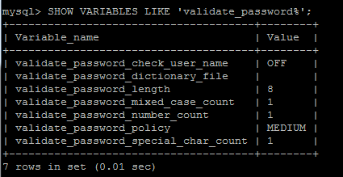
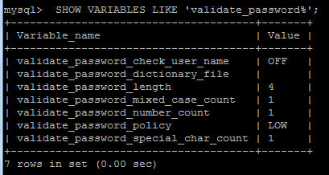

# 记录1
1、Access to fetch at 'http://127.0.0.1:8000/monitor/resources/' from origin 'http://localhost:8080' has been blocked by CORS policy: No 'Access-Control-Allow-Origin' header is present on the requested resource. If an opaque response serves your needs, set the request's mode to 'no-cors' to fetch the resource with CORS disabled.<br>
<br>
这是 CORS（跨源资源共享）问题，这是因为浏览器安全策略阻止了一个域上的网页获取另一个域上的资源。当你的前端应用尝试从不同的端口或域（在这个例子中是 localhost:8080）请求 http://127.0.0.1:8000/monitor/resources/ 上的数据时，就会发生这种情况。
为了解决这个问题，我需要在 Django 后端配置 CORS 头部。你可以使用 django-cors-headers 包轻松地处理这个问题。<br>
1）安装这个包<br>
```sh
pip install django-cors-headers
```
2）将它添加到你的 INSTALLED_APPS 和 MIDDLEWARE 配置中。在你的Django项目的 settings.py 文件中，添加以下配置<br>
```python
# settings.py

INSTALLED_APPS = [
    # ...其他已安装的应用...
    'corsheaders',
    # ...其他已安装的应用...
]

MIDDLEWARE = [
    # ...其他中间件...
    'corsheaders.middleware.CorsMiddleware',
    'django.middleware.common.CommonMiddleware',
    # ...其他中间件...
]

# 如果你想允许所有域名访问
CORS_ALLOW_ALL_ORIGINS = True

# 如果你想只允许特定的域名访问
# CORS_ALLOWED_ORIGINS = [
#     "http://localhost:8080",
#     "http://127.0.0.1:8080",
# ]
```
如果你的前端应用只在开发中从特定的几个域名请求资源，你可以使用 CORS_ALLOWED_ORIGINS 并列出这些域名而不是使用 CORS_ALLOW_ALL_ORIGINS，这样可以提高安全性。<br>
3）重启你的 Django 服务器，现在应该可以正常访问资源了。<br>


# 记录2
2、mysql数据库的ERROR 1819 (HY000): Your password does not satisfy the current policy requirements
~~~
今天安装mysql再修改密码时遇到

ERROR 1819 (HY000): Your password does not satisfy the current policy requirements

产生的原因：自定义密码太简单，出现了不符合密码策略的问题

查看 mysql 初始的密码策略

SHOW VARIABLES LIKE 'validate_password%';
~~~

~~~
如果遇到
ERROR 1820 (HY000): You must reset your password using ALTER USER statement before executing this statement.

修改策略，及密码长度
~~~
```sh
set global validate_password_policy=0
set global validate_password_length=1;
```

~~~
validate_password_policy取值
0 or LOW     只验证长度
1 or MEDIUM  验证长度、数字、大小写、特殊字符
2 or STRONG  验证长度、数字、大小写、特殊字符、字典文件
~~~
再次执行修改密码语句
```sh
CREATE USER 'lgh'@'%' IDENTIFIED BY '2002';
```

# 记录3
3、安装/更新 MySQL：GPG key at file:///etc/pki/rpm-gpg/RPM-GPG-KEY-mysql  <br>

woc这个bug弄了好几个小时，无语了。<br>
去这个网站：https://repo.mysql.com/   <br>
复制最新版的 GPG 内容进去 Linux 的 /etc/pki/rpm-gpg/RPM-GPG-KEY-mysql


# 记录4
4、
~~~
Traceback (most recent call last):
  File "/opt/project/db_web/lib/python3.9/site-packages/django/db/backends/mysql/base.py", line 15, in <module>
    import MySQLdb as Database
  File "/opt/project/db_web/lib/python3.9/site-packages/MySQLdb/__init__.py", line 17, in <module>
    from . import _mysql
ImportError: libmysqlclient.so.20: cannot open shared object file: No such file or directory

The above exception was the direct cause of the following exception:
django.core.exceptions.ImproperlyConfigured: Error loading MySQLdb module.
Did you install mysqlclient?
~~~
answer:
~~~
pip install pymysql

Then, edit the __init__.py file in your project origin dir(the same as settings.py)

add:

import pymysql
pymysql.install_as_MySQLdb()
~~~

# 记录5
问题：当你部署好了前后端到服务器上，你会发现在宿主机上的网页调用不了后端api，调用不了后端api我们就没有办法进行前后端交互，那么是如何解决这一个问题的呢？<br>
<br>
answer:（为了解决这个问题也是耗费很长时间啊。）<br>
使用 PowerShell 的 Test-NetConnection 命令，你可以检查宿主机是否能够通过 TCP 连接到虚拟机的 8000 端口：<br>
```sh
Test-NetConnection -ComputerName 172.31.178.221 -Port 8000
```
查看测试结果——TcpTestSucceeded: False

没有明确看到允许 TCP 端口 8000 的规则。由于 iptables 的规则是按顺序处理的，你需要添加一条规则来允许 TCP 端口 8000。

```sh
sudo iptables -I INPUT -p tcp --dport 8000 -j ACCEPT
```
这条命令将在 INPUT 链的最开始插入（-I）一条新规则，允许（-j ACCEPT）进入 TCP 协议的数据包，目的端口是 8000（--dport 8000）。

在添加了规则之后，你可以再次查看 iptables 的规则集，确保新规则已经添加：

```sh
sudo iptables -L -v -n
```
这个命令会以详细模式列出所有规则，包括每条规则的包计数和字节计数。你应该能够在 INPUT 链看到新的规则。

如果你希望这个规则在系统重启后依然有效，你需要确保 iptables 规则被持久化。至于持久化的方法你自己去搜索一下相关信息吧。

<br>

## 但是，又出现了新的问题！

(这个问题不说了，因为看解决方法就知道是怎么回事)<br>
我们要监听0.0.0.0:8000（这样它可以接受来自所有IP的连接），而不仅仅是127.0.0.1:8000。<br>
虚拟机绑定到了127.0.0.1，这意味着它只能接受从同一台机器（即虚拟机本身）发起的请求。如果你想从其他机器（比如你的本机）访问这个服务，你需要确保Django服务绑定到虚拟机的一个外部可访问的网络接口。<br>
要检查你的服务器是否在监听0.0.0.0:8000，可以在服务器上使用以下命令：<br>

```sh
sudo netstat -tuln | grep 8000
```

对于Django来说，通常在启动服务时可以指定IP地址和端口，使用如下命令：

```sh
python manage.py runserver 0.0.0.0:8000
```
这个命令会让Django在0.0.0.0上监听端口8000，这样就可以从任何IP地址访问你的Django应用。如果你没有指定0.0.0.0，Django默认只会在127.0.0.1上监听，这意味着它只会接受本机（localhost）发起的连接。

Gunicorn启动命令的例子:

```sh
gunicorn --workers 3 --bind 0.0.0.0:8000 myproject.wsgi:application
```
这里myproject是你的Django项目名，wsgi是包含WSGI应用对象的Python模块。

启动Gunicorn后，使用netstat或者lsof命令确认服务正在监听正确的接口,这些命令会显示所有在8000端口上监听的服务。你应该能够看到Gunicorn在0.0.0.0:8000上的条目。

绑定到0.0.0.0意味着你的Django应用现在应该能够接受来自任何IP地址的请求，前提是没有任何网络防火墙或者安全组设置阻止访问。

## 但是但是，还有一个新问题!

直接给出解决方法<br>
简单来说，观察/var/log/nginx/error.log里面的错误日志，发现了权限拒绝的错误。<br>
在 Linux 系统中，非 root 用户默认无法绑定到 1024 以下的端口号，这由系统的安全策略决定。看起来你试图让 Nginx 监听端口 8000。

！！！！
如果你已经在使用 Gunicorn 运行你的 Django 应用并且已经绑定到了端口 8000，你不能再让 Nginx 监听同一个端口，因为一个端口同一时间只能被一个进程监听。
！！！！

所以在nginx的配置文件/etc/nginx/nginx.conf中，将server监听的端口改为80就行。

<br>
经过一通操作之后，之后我们的开发就可以直接在虚拟机跑了，代码也可以直接改虚拟机中的，另外，我们可以直接在宿主机看到网页端。


